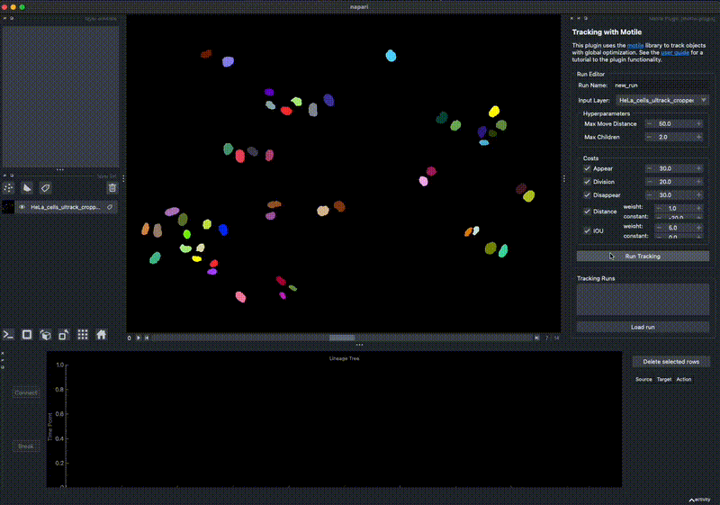

# [DEV] Motile Napari Plugin with lineage tree visualization

Development extended version of the [Motile Napari plugin](https://github.com/funkelab/motile_napari_plugin) aiming to implement interactive visualization and annotation using pyqtgraph. Currently tracks can be viewed in an interactive lineage tree plot, but the user feedback is not yet incorporated in the next solve. 

## Motile Napari Plugin

A plugin for tracking with [motile](https://github.com/funkelab/motile) in napari. 
Motile is a library that makes it easy to solve tracking problems using optimization 
by framing the task as an Integer Linear Program (ILP).
See the motile [documentation](https://funkelab.github.io/motile) 
for more details on the concepts and method.

----------------------------------

## Installation

This plugin depends on [motile](https://github.com/funkelab/motile), which in 
turn depends on gurobi and ilpy. These dependencies must be installed with 
conda before installing the plugin with pip.

    conda create -n motile-plugin python=3.10
    conda activate motile-plugin
    conda install -c conda-forge -c funkelab -c gurobi ilpy
    pip install git+https://github.com/funkelab/motile-napari-plugin.git

## Issues

If you encounter any pyqtgraph related problems, please 
[file an issue](https://github.com/AnniekStok/motile_napari_plugin/issues)
along with a detailed description.
